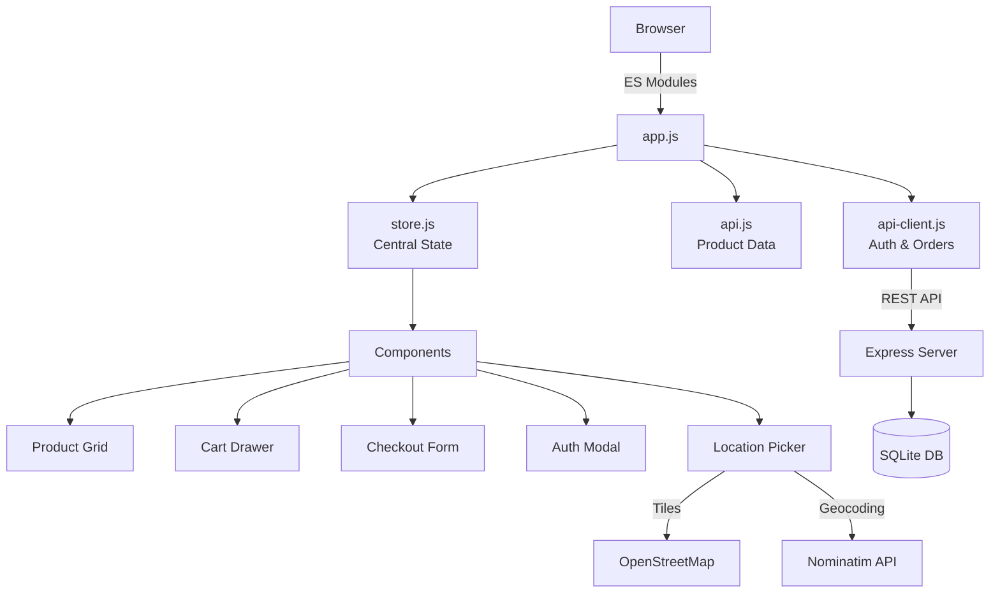

<p align="center">
  
</p>

<h1 align="center">LUXE — Premium E-Commerce</h1>

<p align="center">
  <em>A full-stack e-commerce web application built with Vanilla JavaScript — zero frameworks, maximum performance.</em>
</p>

<p align="center">
  
  
  
  
  
  
  
  
</p>

<p align="center">
  
  
  
</p>

---

## ✨ Features

| Feature | Description |
|:---|:---|
| 🛍️ **Dynamic Product Grid** | 20 products rendered from JSON with lazy-loaded images and staggered animations |
| 🔍 **Advanced Filtering** | Real-time search, category checkboxes, price range slider, rating filter, sort options |
| 🛒 **Interactive Cart** | Slide-out drawer with quantity controls, live subtotal/tax/total calculations |
| 👁️ **Product Quick View** | Modal with full details, quantity selector, feature badges |
| 📦 **Multi-Step Checkout** | 3-step form (Shipping → Payment → Review) with real-time RegEx validation |
| 🔐 **User Authentication** | Register & login with bcrypt hashing + JWT tokens, session persistence |
| 📍 **GPS Location Picker** | Interactive Leaflet map, GPS geolocation, drag-to-set, reverse geocoding |
| 💾 **Database Persistence** | Orders, users, and locations saved to SQLite via REST API |
| 📱 **Responsive Design** | Mobile-first with breakpoints at 480px, 768px, and 1024px |
| 🎨 **Premium Aesthetics** | Glassmorphism, gradients, micro-animations, CSS custom properties |

---

## 🛠️ Tech Stack

### Frontend
| Technology | Purpose |
|:---|:---|
|  | Application logic, ES Modules |
|  | Semantic markup |
|  | Custom properties, Flexbox, Grid, Animations |
|  | Interactive map for GPS location picker |
|  | Map tiles & Nominatim geocoding |

### Backend
| Technology | Purpose |
|:---|:---|
|  | Server runtime |
|  | REST API framework |
|  | Embedded database (via better-sqlite3) |
|  | Token-based authentication |
|  | Password hashing |

---

## 📁 Project Structure

```
luxe-ecommerce/
├── 📄 index.html              # Single-page app shell
├── 📄 server.js               # Express server + REST API
├── 📄 db.js                   # SQLite database setup
├── 📄 package.json            # Dependencies & scripts
├── 📄 .gitignore              # Git ignore rules
│
├── 📂 data/
│   └── products.json          # Product catalog (20 items)
│
├── 📂 css/
│   ├── variables.css          # Design tokens & theme
│   ├── base.css               # Reset & global typography
│   ├── layout.css             # Grid layout & hero section
│   ├── animations.css         # @keyframes definitions
│   ├── responsive.css         # Mobile-first breakpoints
│   └── 📂 components/
│       ├── header.css         # Glassmorphism header
│       ├── sidebar.css        # Filter sidebar
│       ├── product-card.css   # Product cards & skeleton loaders
│       ├── cart.css           # Slide-out cart drawer
│       ├── modal.css          # Quick view modal
│       ├── checkout.css       # Multi-step checkout form
│       ├── footer.css         # Footer layout
│       ├── auth.css           # Login/register modal
│       └── location.css       # GPS map modal
│
└── 📂 js/
    ├── app.js                 # Entry point & bootstrap
    ├── store.js               # Central state management
    ├── api.js                 # Product data fetching
    ├── api-client.js          # Auth & order API client
    ├── 📂 utils/
    │   ├── helpers.js         # DOM utils, currency, toast, debounce
    │   └── validators.js      # RegEx form validators
    └── 📂 components/
        ├── header.js          # Header scroll & mobile menu
        ├── filters.js         # Search, category, price, rating, sort
        ├── productCard.js     # Card rendering & interactions
        ├── productList.js     # Product grid & skeleton loading
        ├── cart.js            # Cart drawer logic
        ├── quickView.js       # Product detail modal
        ├── checkout.js        # Multi-step form & API submission
        ├── auth.js            # Login/register & JWT management
        └── location.js        # GPS, Leaflet map, geocoding
```

---

## 🚀 Getting Started

### Prerequisites

- **Node.js** v18+ — [Download](https://nodejs.org)

### Installation

```bash
# Clone the repository
git clone https://github.com/your-username/luxe-ecommerce.git
cd luxe-ecommerce

# Install dependencies
npm install

# Start the server
npm start
```

Open **http://localhost:3000** in your browser.

---

## 📡 API Reference

### Authentication

| Method | Endpoint | Body | Description |
|:---|:---|:---|:---|
| `POST` | `/api/auth/register` | `{ name, email, password, phone? }` | Create a new account |
| `POST` | `/api/auth/login` | `{ email, password }` | Sign in, returns JWT |
| `GET` | `/api/auth/me` | — | Get current user (🔒 auth) |

### Orders

| Method | Endpoint | Body | Description |
|:---|:---|:---|:---|
| `POST` | `/api/orders` | `{ items, shipping_address, subtotal, tax, total }` | Place an order (🔒 auth) |
| `GET` | `/api/orders` | — | Get order history (🔒 auth) |

### Locations

| Method | Endpoint | Body | Description |
|:---|:---|:---|:---|
| `POST` | `/api/locations` | `{ lat, lng, address, label?, is_default? }` | Save a location (🔒 auth) |
| `GET` | `/api/locations` | — | Get saved locations (🔒 auth) |

> 🔒 = Requires `Authorization: Bearer <token>` header

---

## 🗄️ Database Schema

```sql
users (id, name, email, password_hash, phone, address, created_at)
orders (id, user_id, items, shipping_address, subtotal, tax, total, status, created_at)
user_locations (id, user_id, label, lat, lng, address, is_default, created_at)
```

---

## 🏗️ Architecture



---

## 🎨 Design System

| Token | Value | Usage |
|:---|:---|:---|
| `--color-primary` | `#6c5ce7` | Buttons, accents, links |
| `--color-accent` | `#00b894` | Success states, badges |
| `--color-error` | `#e17055` | Error states, validation |
| `--radius-md` | `12px` | Card corners, inputs |
| `--shadow-lg` | `0 20px 60px…` | Elevated surfaces |
| `--transition-base` | `250ms ease` | Standard interactions |

---

## 📱 Responsive Breakpoints

| Breakpoint | Target | Layout |
|:---|:---|:---|
| `≥ 1024px` | 🖥️ Desktop | Sidebar + 3-col grid |
| `768px – 1023px` | 📱 Tablet | No sidebar, 2-col grid |
| `≤ 767px` | 📱 Mobile | Single column, hamburger menu |

---

## 🔒 Security

- Passwords hashed with **bcrypt** (10 salt rounds)
- Authentication via **JWT** tokens (7-day expiry)
- Input validation on both client and server
- SQL injection prevention with parameterized queries
- CORS enabled for cross-origin requests

---

## 📄 License

This project is licensed under the **MIT License**.

---
## ⭐ If you like this project, consider sponsoring me
---
<p align="center">
  Built with ❤️ using Vanilla JavaScript
</p>
